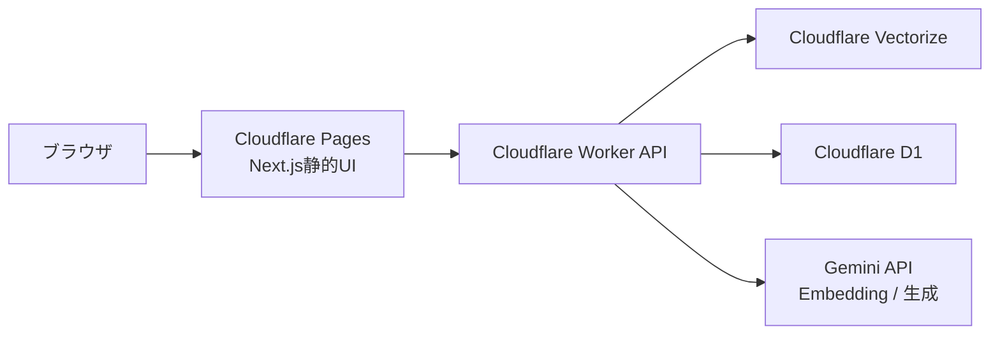
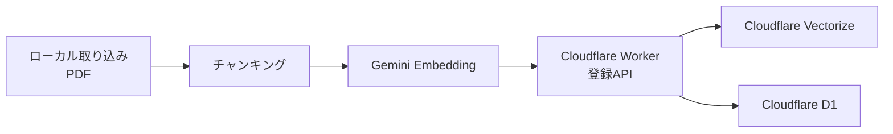

# アーキテクチャ

```mermaid
flowchart LR
  Browser[ブラウザ] --> Pages[Cloudflare Pages\nNext.js静的UI]
  Pages --> Worker[Cloudflare Worker API]
  Worker --> Vectorize[Cloudflare Vectorize]
  Worker --> D1[Cloudflare D1]
  Worker --> Gemini[Gemini API\nEmbedding / 生成]
```

```mermaid
flowchart LR
  Local[ローカル取り込み\nPDF] --> Chunk[チャンキング]
  Chunk --> Embed[Gemini Embedding]
  Embed --> Worker2[Cloudflare Worker\n登録API]
  Worker2 --> Vectorize2[Cloudflare Vectorize]
  Worker2 --> D12[Cloudflare D1]
```
