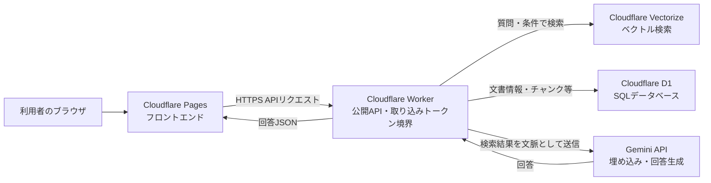
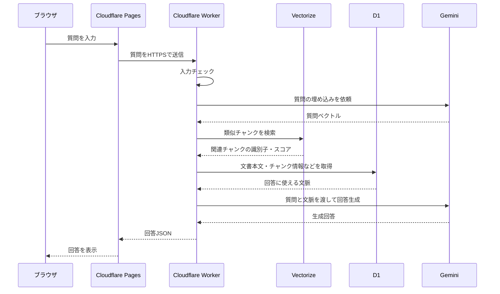
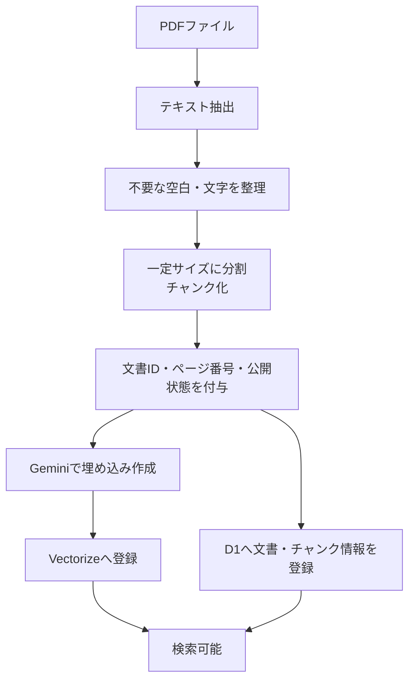
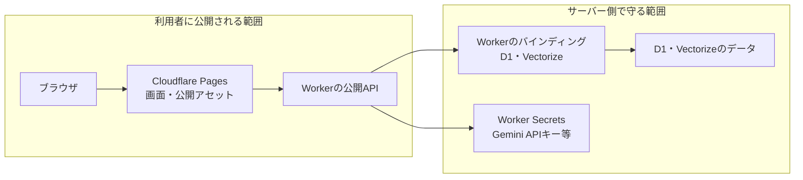

# アーキテクチャ

## 1. 全体構成

このシステムは、ブラウザから質問を受け取り、Cloudflare Worker が検索と生成を仲介する RAG 構成です。
画面は Cloudflare Pages、メタデータは D1、検索用ベクトルは Vectorize、回答生成と埋め込み作成は Gemini を利用します。

### 役割を簡単に説明

- **Cloudflare Pages**：利用者が見る画面を配信します。秘密情報は置きません。
- **Cloudflare Worker**：ブラウザからのリクエストを受け、検索・データ取得・Gemini 呼び出しを行います。秘密情報を扱う公開側サーバー境界です。
- **D1**：文書名、チャンク、公開状態、識別子など、表形式で管理しやすい情報を保存します。
- **Vectorize**：文章を数値ベクトルに変換して保存し、質問に意味が近いチャンクを検索します。
- **Gemini**：文章の埋め込み作成と、検索結果を使った回答生成を担当します。

## 2. 質問フロー

1. 利用者が Pages の画面で質問します。
2. Worker が質問を検証し、Gemini で検索用ベクトルを作ります。
3. Vectorize で意味の近いチャンクを検索します。
4. D1 から文書の本文やチャンク情報を取得します。権限による絞り込みは未実装です。
5. Worker が検索結果だけを文脈として Gemini に渡し、回答を生成します。
6. Worker は回答をブラウザへ返します。

## 3. PDF取り込みフロー

PDF の取り込みは、公開 API と分離した管理・バッチ処理として扱います。

- PDF を検索可能なテキストに変換し、長い文章をチャンクに分割します。
- 各チャンクに文書 ID、ページ番号、公開状態などを付けます。
- 検索用データは Vectorize、管理用データは D1 に登録します。
- 片方だけ登録に成功する場合に備え、再実行や重複登録への対策が必要です。

## 4. 公開範囲と秘密情報の境界

- Pages の HTML、JavaScript、公開設定値は利用者に見られる前提で作ります。
- Gemini API キーなどの秘密値はブラウザや Pages に埋め込まず、Worker の Secret として管理します。
- D1 と Vectorize への接続情報は Worker からだけ使い、ブラウザに渡しません。
- この文書には API キー、トークン、実際の秘密値を記載しません。
- 現在、部門別アクセス制御、公開・非公開文書フィルタ、RLS（行単位の権限制御）は未実装です。D1 と Vectorize に権限フィルタはないため、社内本番用途では認証・認可と検索前の厳密なフィルタなど、追加対策が必須です。
- `ask` と `search` は匿名アクセス可能です。`ingest` だけが `X-Ingest-Token` による認証対象です。
- `CORS_ORIGIN` が未設定の場合の動作に注意し、本番では許可するPagesドメインを限定して設定します。

## 5. API一覧（実装済み）

現在確認できている API は次の4つです。文書一覧 API は実装していません。

| API | 主な用途 | 呼び出し元 | 秘密情報 |
|---|---|---|---|
| `GET /health` | ヘルスチェック | 監視・運用者 | 詳細な内部情報は返さない |
| `POST /api/v1/ask` | 検索結果を使った Gemini 回答生成 | Pagesなど | 匿名アクセス可能。Gemini Secret は Worker 内だけで使用 |
| `POST /api/v1/search` | 検索チャンクの検索 | Pagesなど | 匿名アクセス可能。ただし検索チャンク本文を返すため、公開運用では管理者向けに制限するか本文を返さない設計が必要 |
| `POST /api/v1/ingest` | 文書・チャンクを D1 と Vectorize に登録 | 管理処理 | `X-Ingest-Token` が必要 |

## 6. 現状の制約

- Gemini、Vectorize、D1 など外部サービスの障害・遅延・利用制限の影響を受けます。
- 検索結果と Gemini の生成結果に依存するため、誤回答の可能性があります。
- PDF の画像内文字、表、複雑な段組みは、テキスト抽出時に崩れる可能性があります。
- チャンク分割、埋め込みモデル、検索件数、プロンプトで回答品質が変わります。
- D1 と Vectorize は役割が異なるため、登録・更新・削除の状態が一時的にずれる可能性があります。
- レート制限、認証、監査ログ、個人情報の取り扱いは追加設計が必要です。
- `ask` と `search` は匿名で呼び出せるため、社内文書を扱う公開運用には不十分です。
- `search` は検索チャンク本文を返します。公開運用では管理者向けに制限するか、識別子・スコアなど本文以外だけを返す設計に変更する必要があります。
- Gemini のエラーや入力内容をログへ詳細に残さず、秘密値・個人情報・実文書本文を記録しないなど、最小限のログ運用にします。
- この文書の Cloudflare Pages → Worker → D1/Vectorize → Gemini が現行経路です。Supabase、FastAPI、3072次元SQLの構成は旧教材経路であり、現行Workerの768次元Cloudflare経路とは別物です。

## 7. Phase 2 の課題

1. **認証・認可**：`X-Ingest-Token` だけに頼らず、ask/searchも含めた利用者認証を追加する。
2. **アクセス制御**：部門別権限、公開・非公開文書フィルタ、RLS相当の仕組みを追加する。
3. **取り込みの信頼性**：差分更新、再実行、重複防止、失敗状態の記録、再処理を整備する。
4. **外部サービス連携**：Slack、Word、Confluenceからの取り込みを検討する。
5. **回答品質の評価**：質問例と正解例を用意し、検索と回答の正確さを継続的に確認する。
6. **根拠表示**：回答に文書名やページ番号を表示し、利用者が確認できるようにする。
7. **運用監視**：エラー、遅延、使用量、コスト、レート制限を確認できる監視・メトリクスを追加する。
8. **セキュリティ対策**：プロンプトインジェクション、機密情報の漏えい、ログへの秘密値混入を検査する。
9. **PDF対応の改善**：OCR、表や見出しの構造化、ページ単位のメタデータ付与を検討する。
